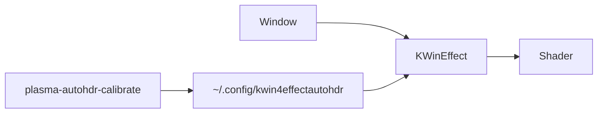

# AutoHDR

A KWin desktop effect for KDE Plasma 6. It tone-maps individual windows so SDR and mixed-content apps look better on an HDR display. The effect description in KWin is "spatial illumination matching for Plasma 6".

## What it does

When AutoHDR is active on a window, KWin redirects that window offscreen and runs a GLSL fragment shader on it. The shader applies black point adjustment, a tone curve lookup table, vibrance, and gamut expansion. It reads KDE's HDR calibration (reference white and peak luminance) from your existing display settings and stores per-application profiles on disk.



- Eligible windows: normal, dialog, and utility types. Desktop shells, docks, tooltips, menus, and splash screens are skipped.
- Profiles are keyed by `.desktop` file name, resource class, or window class.
- Calibrated apps can auto-apply the shader when they open.

## Requirements

| Requirement | Notes |
|-------------|-------|
| KDE Plasma 6 / KWin 6 | Built against Qt 6 and KF6 |
| HDR display with KDE HDR enabled | Uses reference and peak nits from KDE's HDR settings |
| OpenGL offscreen effects | Required by KWin's offscreen effect path |
| Python 3 + PySide6 | Only for the calibration dialog |

The install script handles dependencies on Arch, CachyOS, Manjaro, Debian, Ubuntu, Mint, Fedora, and RHEL-family distros. Other distros can install the packages manually and run with `--skip-deps`.

## Installation

```bash
git clone https://github.com/LewisTansley/PlasmaAutoHDR.git
cd PlasmaAutoHDR
./install.sh
```

Useful options:

- `--skip-deps` if you already have build dependencies installed
- `-y` restart KWin after install without prompting
- `-n` do not offer to restart KWin
- `--clean` delete the build directory and reconfigure from scratch
- `-j N` parallel make jobs

To build only the effect (no dependency install, no KWin restart prompt):

```bash
cd kwin4-effect-autohdr
./build-install.sh
```

Add `--reload` to that script to reload KWin over D-Bus after install.

After install:

1. Open **System Settings → Desktop Effects** and enable **AutoHDR**.
2. Restart KWin if the installer asks you to.

## Usage

| Shortcut | Action |
|----------|--------|
| `Meta+Shift+H` | Toggle AutoHDR on the active window |
| `Meta+Ctrl+H` | Open the calibration engine for the active window |

Typical workflow:

1. Enable the effect in System Settings.
2. Focus the window you want to tune (a game, browser, media player, etc.).
3. Press `Meta+Ctrl+H` and adjust the tone curve, vibrance, and gamut expansion.
4. Save. The profile is stored under that application's identity.
5. Turn on auto-activate if you want the shader applied whenever that app opens.

## Configuration

Settings live in `~/.config/kwin4effectautohdr`.

You can edit them in two places:

- **System Settings → Desktop Effects → AutoHDR**: global defaults, list of calibrated applications, and the "automatically apply to calibrated apps" toggle.
- **Calibration engine** (`plasma-autohdr-calibrate`): per-window tuning opened from the active window via `Meta+Ctrl+H`.

### Tone curve presets

Built-in presets: Linear, Balanced, Lifted Shadows, Soft Shadows, Vivid Highlights, High Contrast, Exponential, Custom, and User. Custom curves use draggable control points. User presets are saved in the config file and can be reused across applications.

Per-profile settings include max nits, reference nits, gamut expansion, black point, vibrance, tone curve points, and an optional per-app auto-activate flag.

## Building from source

If you prefer not to use `install.sh`, you need:

- CMake 3.16 or newer
- A C++20 compiler
- Extra CMake Modules (ECM)
- Qt 6 (Core, Gui, DBus, Widgets)
- KF6: Config, ConfigWidgets, KCMUtils, CoreAddons, GlobalAccel, I18n
- KWin development packages
- Python 3 and PySide6 (runtime, for calibration)

On Arch:

```
base-devel cmake extra-cmake-modules qt6-base qt6-tools kwin
kconfig kconfigwidgets kcmutils kcoreaddons kglobalaccel ki18n pyside6
```

On Debian/Ubuntu:

```
build-essential cmake extra-cmake-modules qt6-base-dev qt6-base-dev-tools
qt6-tools-dev kwin-dev libkf6config-dev libkf6configwidgets-dev
libkf6kcmutils-dev libkf6coreaddons-dev libkf6globalaccel-dev
libkf6i18n-dev python3-pyside6.qtwidgets
```

On Fedora:

```
cmake gcc-c++ extra-cmake-modules qt6-qtbase-devel qt6-qttools-devel kwin-devel
kf6-kconfig-devel kf6-kconfigwidgets-devel kf6-kcmutils-devel
kf6-kcoreaddons-devel kf6-kglobalaccel-devel kf6-ki18n-devel python3-pyside6
```

Then run `kwin4-effect-autohdr/build-install.sh`.

## License

GPL-2.0-or-later. See source file headers for the full text.

## Author

Luu · [github.com/LewisTansley/PlasmaAutoHDR](https://github.com/LewisTansley/PlasmaAutoHDR)
