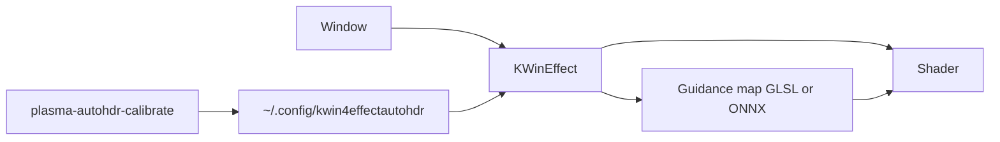

# AutoHDR

A KWin desktop effect for KDE Plasma 6. It tone-maps individual windows so SDR and mixed-content apps look better on an HDR display. The effect description in KWin is "spatial illumination matching for Plasma 6".

## What it does

When AutoHDR is active on a window, KWin redirects that window offscreen and runs a GLSL fragment shader on it. The shader applies black point adjustment, a tone curve lookup table, vibrance, and gamut expansion. It reads KDE's HDR calibration (reference white and peak luminance) from your existing display settings and stores per-application profiles on disk.

Optional **AI-enhanced HDR** adds a low-resolution content-aware guidance map on top of the classical path. It recovers shadow and highlight micro-detail lost to 8-bit SDR, adds perceptual depth (local contrast) in flat midtones, and steers highlight expansion (RTX HDR–style). On AMD/Mesa the default is a GLSL analysis pass; if ONNX Runtime is installed at build time, Auto can use the Vulkan EP then CPU.


```mermaid
flowchart LR
    Window --> KWinEffect
    KWinEffect --> Shader
    KWinEffect --> Guidance["Guidance map GLSL or ONNX"]
    Guidance --> Shader
    ConfigFile["~/.config/kwin4effectautohdr"] --> KWinEffect
    CalibrateUI["plasma-autohdr-calibrate"] --> ConfigFile
```

- Eligible windows: normal, dialog, and utility types. Desktop shells, docks, tooltips, menus, and splash screens are skipped.
- Profiles are keyed by `.desktop` file name, resource class, or window class.
- Calibrated apps can auto-apply the shader when they open.

## Requirements

| Requirement | Notes |
|-------------|-------|
| KDE Plasma 6 / KWin 6 | Built against Qt 6 and KF6 |
| HDR display with KDE HDR enabled | Uses reference and peak nits from KDE's HDR settings |
| OpenGL offscreen effects | Required by KWin's offscreen effect path |
| Python 3 + PySide6 | Only for the calibration dialog |
| onnxruntime (optional) | Enables ONNX guidance (Vulkan/CPU). Without it, AI mode uses GLSL only |

The install script handles dependencies on Arch, CachyOS, Manjaro, Debian, Ubuntu, Mint, Fedora, and RHEL-family distros. Other distros can install the packages manually and run with `--skip-deps`.

## Installation

```bash
git clone https://github.com/LewisTansley/PlasmaAutoHDR.git
cd PlasmaAutoHDR
./install.sh
```

Useful options:

- `--skip-deps` if you already have build dependencies installed
- `-y` restart KWin after install without prompting
- `-n` do not offer to restart KWin
- `--clean` delete the build directory and reconfigure from scratch (required after a KWin/Plasma upgrade)
- `-j N` parallel make jobs

After upgrading KWin or Plasma, rebuild with `--clean`. KWin effect plugins embed the KWin version at compile time; a stale build cache leaves the effect installed but hidden from Desktop Effects.

To build only the effect (no dependency install, no KWin restart prompt):

```bash
cd kwin4-effect-autohdr
./build-install.sh
```

Add `--reload` to that script to reconfigure KWin over D-Bus after install (does not reload new `.so` files; use `kwin_wayland --replace` or `install.sh -y` instead).

Verify the installed plugin matches your KWin version:

```bash
kwin4-effect-autohdr/check-plugin-version.sh
```

After install:

1. Open **System Settings → Desktop Effects** and enable **AutoHDR**.
2. Restart KWin if the installer asks you to.

## Usage

| Shortcut | Action |
|----------|--------|
| `Meta+Shift+H` | Toggle AutoHDR on the active window |
| `Meta+Ctrl+H` | Open the calibration engine for the active window |

Typical workflow:

1. Enable the effect in System Settings.
2. Focus the window you want to tune (a game, browser, media player, etc.).
3. Press `Meta+Ctrl+H` and adjust the tone curve, vibrance, and gamut expansion.
4. Save. The profile is stored under that application's identity.
5. Turn on auto-activate if you want the shader applied whenever that app opens.

## Configuration

Settings live in `~/.config/kwin4effectautohdr`.

You can edit them in two places:

- **System Settings → Desktop Effects → AutoHDR**: global defaults, list of calibrated applications, and the "automatically apply to calibrated apps" toggle.
- **Calibration engine** (`plasma-autohdr-calibrate`): per-window tuning opened from the active window via `Meta+Ctrl+H`.

### Tone curve presets

Built-in presets: Linear, Balanced, Lifted Shadows, Soft Shadows, Vivid Highlights, High Contrast, Exponential, Custom, and User. Custom curves use draggable control points. User presets are saved in the config file and can be reused across applications.

Per-profile settings include max nits, reference nits, gamut expansion, black point, vibrance, tone curve points, optional AI-enhanced HDR / strength, and an optional per-app auto-activate flag.

### AI-enhanced HDR

Disabled by default. Enable globally in **System Settings → Desktop Effects → AutoHDR**, or per app in the calibration overlay.

| Setting | Meaning |
|---------|---------|
| AI-enhanced HDR | Content-aware shadow/highlight detail recovery, perceptual depth, and highlight expansion |
| AI strength | How strongly the guidance map applies detail, depth, and expansion (0–100%) |
| AI quality | Guidance/chroma map resolution and update interval (Performance every 3 frames / Balanced every 2 / Quality every frame) |
| AI backend | Auto (ONNX when built-in, else GLSL), ONNX Runtime, or GLSL only |

Guidance map channels (RGBA): highlight expansion, highlight confidence, shadow-detail mask, depth/local-contrast mask.

### AI chroma inference

Disabled by default. Enable globally in **System Settings → Desktop Effects → AutoHDR → AI Chroma Inference**, or per app in the calibration overlay.

| Setting | Meaning |
|---------|---------|
| AI chroma refinement | Y-locked color corrections separate from luminance: chroma banding reduction, highlight color recovery, per-pixel perceptual color intensity |
| Chroma strength | How strongly the chroma map applies (0–100%) |

Chroma map channels (RGBA): correction strength, saturation residual hint, hue residual hint, per-pixel `colorIntensity` blend for PQ remap.

Environment overrides:

| Variable | Effect |
|----------|--------|
| `AUTOHDR_CHROMA=0` | Force chroma AI off |
| `AUTOHDR_CHROMA=1` | Force chroma AI on (global) |
| `AUTOHDR_CHROMA_MODEL` | Path to a chroma `.onnx` model |

| Variable | Effect |
|----------|--------|
| `AUTOHDR_AI=0` | Force AI off |
| `AUTOHDR_AI=1` | Force AI on (global) |
| `AUTOHDR_AI_QUALITY` | `Performance`, `Balanced`, or `Quality` |
| `AUTOHDR_ONNX_MODEL` | Path to a guidance `.onnx` model |
| `AUTOHDR_ONNX_EP` | Force `vulkan`, `cpu`, or `cuda` |
| `AUTOHDR_FLOAT_FBO` | Prefer `GL_RGBA16F` capture (also enabled automatically when AI is on) |

Rebuild the optional ONNX plumbing model with:

```bash
python3 -m venv kwin4-effect-autohdr/.venv-tools
kwin4-effect-autohdr/.venv-tools/bin/pip install onnx numpy
kwin4-effect-autohdr/.venv-tools/bin/python kwin4-effect-autohdr/tools/export_guidance_v1.py
kwin4-effect-autohdr/.venv-tools/bin/python kwin4-effect-autohdr/tools/export_chroma_v0.py
```

Train a learned chroma model (optional):

```bash
pip install torch
python kwin4-effect-autohdr/training/train_chroma.py
python kwin4-effect-autohdr/training/export_chroma_v1.py
```

CMake option: `-DAUTOHDR_ENABLE_ONNX=OFF` to skip ONNX Runtime detection.

## Building from source

If you prefer not to use `install.sh`, you need:

- CMake 3.16 or newer
- A C++20 compiler
- Extra CMake Modules (ECM)
- Qt 6 (Core, Gui, DBus, Widgets)
- KF6: Config, ConfigWidgets, KCMUtils, CoreAddons, GlobalAccel, I18n
- KWin development packages
- Python 3 and PySide6 (runtime, for calibration)

On Arch:

```
base-devel cmake extra-cmake-modules qt6-base qt6-tools kwin
kconfig kconfigwidgets kcmutils kcoreaddons kglobalaccel ki18n pyside6
```

On Debian/Ubuntu:

```
build-essential cmake extra-cmake-modules qt6-base-dev qt6-base-dev-tools
qt6-tools-dev kwin-dev libkf6config-dev libkf6configwidgets-dev
libkf6kcmutils-dev libkf6coreaddons-dev libkf6globalaccel-dev
libkf6i18n-dev python3-pyside6.qtwidgets
```

On Fedora:

```
cmake gcc-c++ extra-cmake-modules qt6-qtbase-devel qt6-qttools-devel kwin-devel
kf6-kconfig-devel kf6-kconfigwidgets-devel kf6-kcmutils-devel
kf6-kcoreaddons-devel kf6-kglobalaccel-devel kf6-ki18n-devel python3-pyside6
```

Then run `kwin4-effect-autohdr/build-install.sh`.

If KWin was upgraded since the last build, pass `--clean` so CMake picks up the new headers. The build script also auto-cleans when it detects a KWin version change.

## License

GPL-2.0-or-later. See source file headers for the full text.

## Author

Luu · [github.com/LewisTansley/PlasmaAutoHDR](https://github.com/LewisTansley/PlasmaAutoHDR)
